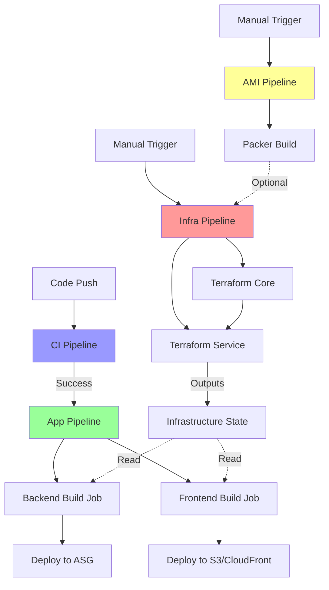
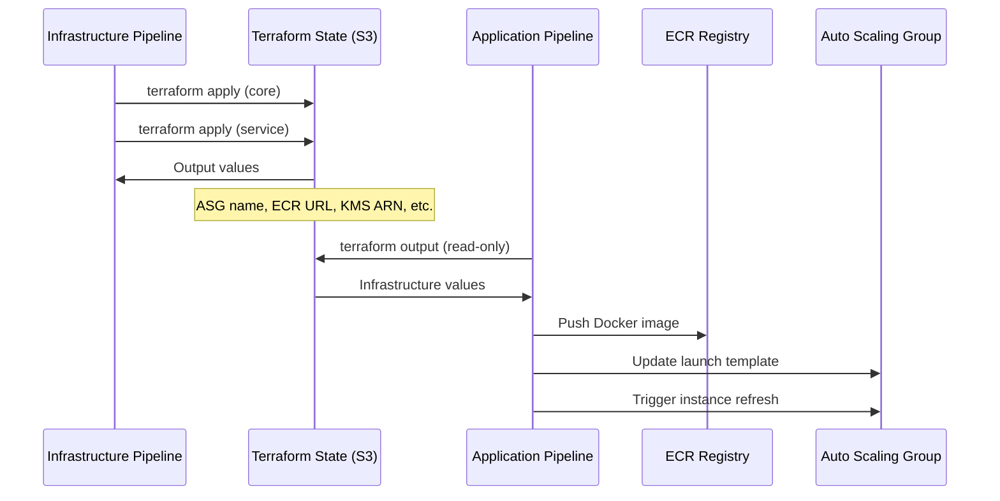
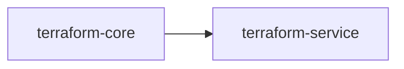
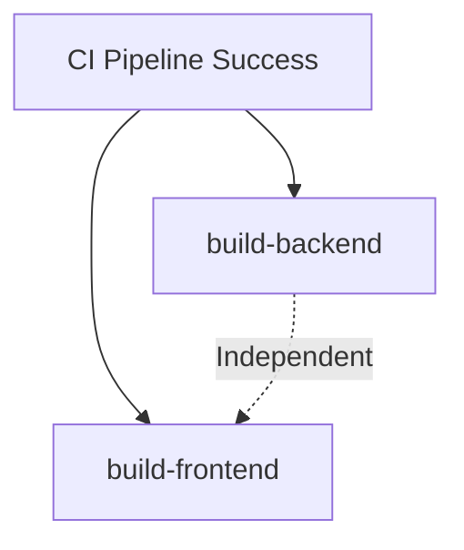
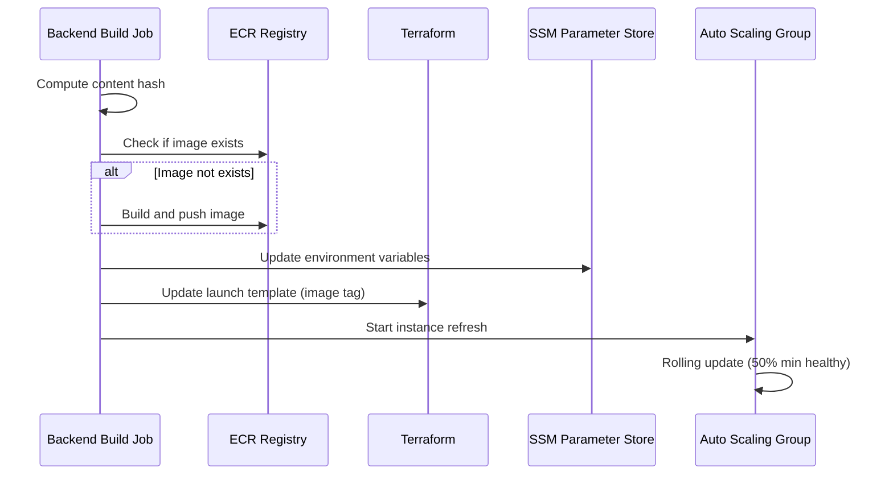
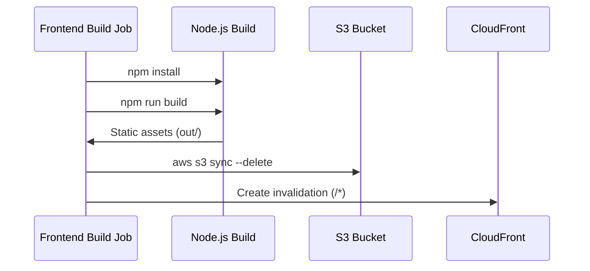

# Design Document: CI/CD Pipeline Refactor

## Overview

This design specifies a two-tier CI/CD pipeline architecture that separates infrastructure provisioning from application deployment. The refactored system consists of three independent workflows:

1. **Infrastructure Pipeline** (`infra.yml`) - Manual Terraform provisioning of AWS resources
2. **Application Pipeline** (`app.yml`) - Automated build and deployment of application code
3. **AMI Build Pipeline** (`ami.yml`) - Optional Packer-based base AMI creation

The separation enables independent infrastructure management, faster application deployments, and clearer pipeline responsibilities. The existing CI pipeline (`ci.yml`) remains unchanged and continues to validate code before deployment.

### Key Design Decisions

- **Manual Infrastructure Trigger**: Infrastructure changes require explicit approval via workflow_dispatch to prevent accidental resource modifications
- **Automatic Application Trigger**: Application deployments trigger on code push and CI success for rapid iteration
- **Parallel Build Jobs**: Backend and frontend builds execute concurrently to minimize deployment time
- **Content-Based Tagging**: Docker images use SHA256 hashes to enable build caching and safe rollbacks
- **State Isolation**: Infrastructure state managed separately from application deployment logic

## Architecture

### Workflow Dependency Graph



### Pipeline Responsibilities

| Pipeline | Trigger | Purpose | Terraform | Application Code |
|----------|---------|---------|-----------|------------------|
| CI | Push/PR | Validation | Validate only | Test only |
| Infrastructure | Manual | Provision AWS resources | Apply changes | No |
| Application | Auto (CI success) | Deploy code | Read outputs | Build & deploy |
| AMI | Manual | Build base image | No | No |

### Data Flow Between Pipelines

The Application Pipeline depends on infrastructure outputs but does not modify infrastructure state:



## Components and Interfaces

### 1. Infrastructure Pipeline (`infra.yml`)

**Purpose**: Provision and manage AWS infrastructure resources using Terraform.

**Trigger**: Manual workflow_dispatch only

**Jobs**:
- `terraform-core`: Applies `.github/terraform/core/` configuration
- `terraform-service`: Applies `.github/terraform/service/` configuration

**Inputs**:
- None (uses GitHub secrets for Terraform variables)

**Outputs** (from `terraform-service` job):
```yaml
outputs:
  asg_name: ${{ steps.tf_output.outputs.asg_name }}
  aws_region: ${{ steps.tf_output.outputs.aws_region }}
  ecr_repository_url: ${{ steps.tf_output.outputs.ecr_repository_url }}
  backend_port: ${{ steps.tf_output.outputs.backend_port }}
  secrets_kms_key_arn: ${{ steps.tf_output.outputs.secrets_kms_key_arn }}
```

**Job Dependencies**:


**Key Implementation Details**:
- Uses path filtering to detect changes in `core/` vs `service/` directories
- Applies core infrastructure only when core files change
- Always applies service infrastructure (depends on core outputs)
- Stores state in S3 backend with DynamoDB locking
- Exports outputs for consumption by Application Pipeline

### 2. Application Pipeline (`app.yml`)

**Purpose**: Build and deploy application code to existing infrastructure.

**Trigger**: 
- Automatic on `workflow_run` completion of CI pipeline (success only)
- Manual via `workflow_dispatch`

**Jobs**:
- `build-backend`: Builds Docker image, pushes to ECR, deploys to ASG
- `build-frontend`: Builds static assets, uploads to S3, invalidates CloudFront

**Inputs**:
- Infrastructure outputs (read from Terraform state)

**Outputs**:
```yaml
# From build-backend job
outputs:
  image: ${{ steps.image_vars.outputs.image }}
  image_tag: ${{ steps.image_vars.outputs.image_tag }}
```

**Job Dependencies**:


**Key Implementation Details**:
- Reads infrastructure outputs using `terraform output` (read-only)
- Backend and frontend jobs execute in parallel (no dependencies)
- Uses content-based image tagging for build caching
- Skips Docker build if image with matching hash exists in ECR
- Updates SSM parameter store with backend environment variables
- Triggers ASG instance refresh for zero-downtime deployment

### 3. AMI Build Pipeline (`ami.yml`)

**Purpose**: Build base AMI with pre-installed dependencies using Packer.

**Trigger**: Manual workflow_dispatch only

**Jobs**:
- `packer-build`: Builds base AMI with Docker, AWS CLI, CloudWatch agent

**Inputs**:
```yaml
inputs:
  force_build:
    description: 'Force rebuild even if AMI with matching hash exists'
    type: boolean
    default: false
```

**Outputs**:
- AMI ID (tagged with configuration hash)

**Key Implementation Details**:
- Computes SHA256 hash of Packer configuration
- Skips build if AMI with matching hash exists (unless force_build=true)
- Creates temporary VPC/subnet for Packer build
- Cleans up temporary networking resources after build
- Deregisters old AMI versions before creating new one
- Tags AMI with PackerHash for idempotent builds

### 4. Backend Build Job

**Responsibilities**:
1. Compute content hash of backend source code and Dockerfile
2. Check if Docker image with matching hash exists in ECR
3. Build and push Docker image if not exists
4. Update SSM parameter with backend environment variables
5. Update ASG launch template with new image tag
6. Trigger ASG instance refresh for deployment

**Interface**:
```yaml
inputs:
  - ecr_repository_url (from Terraform outputs)
  - secrets_kms_key_arn (from Terraform outputs)
  - asg_name (from Terraform outputs)
  - aws_region (from Terraform outputs)

outputs:
  - image: Full ECR image URL
  - image_tag: Content-based SHA256 hash
```

**Content Hash Calculation**:
```bash
HASH=$(find backend -type f \
  \( -name "Dockerfile" -o -path "*/backend/src/*" \
     -o -path "*/backend/requirements.txt" -o -path "*/backend/uv.lock" \) \
  | sort | xargs sha256sum | sha256sum | cut -d ' ' -f 1)
```

**Deployment Flow**:


### 5. Frontend Build Job

**Responsibilities**:
1. Build Next.js static assets
2. Upload assets to S3 bucket
3. Delete removed files from S3 (sync with --delete)
4. Invalidate CloudFront cache

**Interface**:
```yaml
inputs:
  - s3_bucket (from GitHub secrets)
  - cloudfront_distribution_id (from GitHub secrets)
  - aws_region (from Terraform outputs)

outputs:
  - None (deployment status only)
```

**Deployment Flow**:


## Data Models

### Infrastructure Outputs Schema

The Infrastructure Pipeline produces outputs consumed by the Application Pipeline:

```typescript
interface InfrastructureOutputs {
  // Compute
  asg_name: string;                    // Auto Scaling Group name
  backend_launch_template_id: string;  // Launch template ID
  
  // Container Registry
  ecr_repository_url: string;          // ECR repository URL
  
  // Security
  secrets_kms_key_arn: string;         // KMS key for SSM encryption
  
  // Configuration
  aws_region: string;                  // AWS region
  backend_port: number;                // Backend service port
  domain_name: string;                 // Primary domain
  
  // URLs
  backend_url: string;                 // API endpoint URL
  alb_dns_name: string;                // Load balancer DNS
}
```

### Docker Image Metadata

```typescript
interface DockerImageMetadata {
  repository: string;      // ECR repository URL
  tag: string;             // Content-based SHA256 hash
  digest: string;          // Image digest (from ECR)
  pushed_at: string;       // ISO 8601 timestamp
  size_bytes: number;      // Image size
}
```

### ASG Instance Refresh Configuration

```typescript
interface InstanceRefreshConfig {
  auto_scaling_group_name: string;
  preferences: {
    min_healthy_percentage: 50;      // Maintain 50% capacity during refresh
    instance_warmup: 60;             // Wait 60s for health checks
  };
  strategy: "Rolling";
}
```

### AMI Metadata

```typescript
interface AMIMetadata {
  ami_id: string;
  ami_name: string;                    // edutrust-base-ami-{timestamp}
  tags: {
    Name: "EduTrust-Base-AMI";
    PackerHash: string;                // SHA256 of Packer config
    OS: "Ubuntu-24.04";
    CreatedBy: "Packer";
  };
  block_device_mappings: {
    device_name: "/dev/sda1";
    volume_size: 8;                    // GB
    volume_type: "gp3";
  }[];
}
```


## Correctness Properties

*A property is a characteristic or behavior that should hold true across all valid executions of a system—essentially, a formal statement about what the system should do. Properties serve as the bridge between human-readable specifications and machine-verifiable correctness guarantees.*

For this CI/CD pipeline refactor, the correctness properties focus on structural validation of workflow configurations. Since GitHub Actions workflows are declarative YAML files, the properties verify that the workflow structure matches the specified architecture rather than testing runtime behavior across multiple inputs.

### Property 1: Infrastructure Pipeline Manual Trigger Only

The Infrastructure Pipeline workflow file SHALL contain only `workflow_dispatch` in its trigger configuration and SHALL NOT contain automatic triggers such as `push`, `pull_request`, or `workflow_run`.

**Validates: Requirements 1.3**

### Property 2: Infrastructure Pipeline Provisions Both Tiers

The Infrastructure Pipeline workflow file SHALL contain jobs that execute `terraform apply` for both core infrastructure (`.github/terraform/core/`) and service infrastructure (`.github/terraform/service/`).

**Validates: Requirements 1.1, 1.2**

### Property 3: Infrastructure Pipeline Excludes Application Code

The Infrastructure Pipeline workflow file SHALL NOT contain steps for building application code, including Docker build commands, npm build commands, or application deployment steps.

**Validates: Requirements 1.4**

### Property 4: Infrastructure Pipeline Exports Required Outputs

The Infrastructure Pipeline's terraform-service job SHALL define outputs for `asg_name`, `ecr_repository_url`, `secrets_kms_key_arn`, `aws_region`, and `backend_port`.

**Validates: Requirements 1.5**

### Property 5: Application Pipeline Automatic Trigger

The Application Pipeline workflow file SHALL contain a `workflow_run` trigger that listens for CI pipeline completion with `types: [completed]` and checks for success status on main and feature branches.

**Validates: Requirements 2.1, 2.2, 2.5, 8.1**

### Property 6: Application Pipeline Read-Only Infrastructure Access

The Application Pipeline workflow file SHALL contain only `terraform output` commands for reading infrastructure state and SHALL NOT contain `terraform apply` commands.

**Validates: Requirements 2.3, 9.2, 9.5**

### Property 7: Parallel Build Job Execution

The Application Pipeline SHALL define backend and frontend build jobs without `needs` dependencies on each other, and neither job SHALL have conditional `if` statements that depend on the other job's completion status.

**Validates: Requirements 2.4, 5.1, 5.2, 5.3, 5.4**

### Property 8: Backend Build Job Complete Workflow

The backend build job SHALL contain steps for: (1) computing content hash of backend source code, (2) checking ECR for existing image, (3) conditionally building and pushing Docker image, (4) updating SSM parameters, (5) updating ASG launch template via terraform apply with `backend_image_tag` variable, and (6) triggering ASG instance refresh.

**Validates: Requirements 3.1, 3.2, 3.3, 3.4, 3.5, 3.6**

### Property 9: Frontend Build Job Complete Workflow

The frontend build job SHALL contain steps for: (1) running `npm install`, (2) running `npm run build`, (3) executing `aws s3 sync` with `--delete` flag, and (4) executing `aws cloudfront create-invalidation` after S3 sync completes.

**Validates: Requirements 4.1, 4.2, 4.3, 4.4**

### Property 10: AMI Pipeline Manual Trigger and Hash-Based Caching

The AMI Pipeline workflow file SHALL contain only `workflow_dispatch` trigger, SHALL compute SHA256 hash of Packer configuration, and SHALL include a conditional check that skips build when an AMI with matching `PackerHash` tag exists in AWS.

**Validates: Requirements 6.1, 6.2, 6.3, 6.4**

### Property 11: AMI Pipeline Independence

The Application Pipeline workflow file SHALL NOT contain `needs` dependencies on the AMI Pipeline or any references to AMI build jobs.

**Validates: Requirements 6.5**

### Property 12: CI Pipeline Dependency Check

The Application Pipeline workflow_run trigger SHALL include a condition that checks `github.event.workflow_run.conclusion == 'success'` to prevent execution when CI pipeline fails.

**Validates: Requirements 7.5**

### Property 13: Backend Job Infrastructure Dependency

The backend build job SHALL read infrastructure outputs using `terraform output` commands or job outputs from a terraform job, specifically retrieving `ecr_repository_url`, `asg_name`, `secrets_kms_key_arn`, and `aws_region`.

**Validates: Requirements 8.2**

### Property 14: Frontend Job Infrastructure Dependency

The frontend build job SHALL use infrastructure values from GitHub secrets or environment variables for S3 bucket name and CloudFront distribution ID.

**Validates: Requirements 8.3**

### Property 15: Application Pipeline State Persistence

The Application Pipeline SHALL read infrastructure outputs from Terraform remote state stored in S3, allowing execution without requiring the Infrastructure Pipeline to have run in the same workflow execution.

**Validates: Requirements 8.4**

### Property 16: Infrastructure Pipeline Independence

The Infrastructure Pipeline workflow file SHALL NOT contain `workflow_run` triggers or `needs` dependencies on other workflows.

**Validates: Requirements 8.5**

### Property 17: Terraform S3 Backend Configuration

The Terraform provider configuration files in both `core/` and `service/` directories SHALL include S3 backend configuration with bucket, key, and region parameters.

**Validates: Requirements 9.1**

### Property 18: Conditional Core Infrastructure Application

The Infrastructure Pipeline SHALL use path filtering (e.g., `dorny/paths-filter`) to detect changes in `.github/terraform/core/**` and conditionally execute terraform apply for core infrastructure only when changes are detected.

**Validates: Requirements 9.3**

### Property 19: Service Infrastructure Always Applied

The Infrastructure Pipeline SHALL always execute terraform apply for service infrastructure since it depends on core infrastructure outputs.

**Validates: Requirements 9.4**

### Property 20: Content-Based Docker Image Tagging

The backend build job SHALL compute a content hash using `sha256sum` of backend source files and Dockerfile, and SHALL use this hash as the Docker image tag.

**Validates: Requirements 10.1**

### Property 21: ECR Image Preservation

The backend build job SHALL NOT contain steps that delete or deregister previous Docker images from ECR, preserving image history for rollback capability.

**Validates: Requirements 10.2**

### Property 22: ASG Instance Refresh Safety Configuration

The ASG instance refresh command SHALL include preferences with `MinHealthyPercentage: 50` and `InstanceWarmup: 60` to maintain availability during deployment.

**Validates: Requirements 10.3**

### Property 23: ASG Instance Refresh Failure Handling

The backend build job SHALL monitor ASG instance refresh status in a loop and SHALL exit with error code when status is `Failed`, `Cancelled`, or `TimedOut`.

**Validates: Requirements 10.4**

### Property 24: CloudFront Cache Invalidation

The frontend build job SHALL execute `aws cloudfront create-invalidation` with path `/*` after S3 sync completes to ensure immediate visibility of changes.

**Validates: Requirements 10.5**

## Error Handling

### Infrastructure Pipeline Errors

**Terraform Apply Failures**:
- **Detection**: Terraform exit code != 0
- **Handling**: Workflow fails immediately, no partial state commits
- **Recovery**: Manual investigation of Terraform error messages, state file inspection
- **Prevention**: Terraform validate and plan in CI pipeline before merge

**ECR Repository Creation Failures**:
- **Detection**: AWS API error when creating or importing ECR repository
- **Handling**: Attempt to import existing repository if creation fails
- **Recovery**: Manual ECR repository creation via AWS console
- **Prevention**: Check for existing repository before creation

**Path Filter Failures**:
- **Detection**: Path filter action returns error
- **Handling**: Default to applying all infrastructure (fail-safe approach)
- **Recovery**: Automatic - workflow continues with full apply
- **Prevention**: Test path filter patterns in CI pipeline

### Application Pipeline Errors

**Docker Build Failures**:
- **Detection**: Docker build exit code != 0
- **Handling**: Job fails, no image push to ECR
- **Recovery**: Fix build errors in source code, push new commit
- **Prevention**: Local Docker build testing, CI pipeline validation

**ECR Push Failures**:
- **Detection**: Docker push exit code != 0 or ECR API error
- **Handling**: Job fails, ASG not updated
- **Recovery**: Retry workflow manually, check ECR permissions
- **Prevention**: Verify ECR authentication before push

**ASG Instance Refresh Failures**:
- **Detection**: Instance refresh status = Failed/Cancelled/TimedOut
- **Handling**: Job fails with error message and status reason
- **Recovery**: Manual ASG instance refresh via AWS console, investigate health check failures
- **Prevention**: Verify launch template configuration, test health check endpoints

**SSM Parameter Update Failures**:
- **Detection**: AWS SSM API error
- **Handling**: Job fails before ASG update
- **Recovery**: Retry workflow, verify KMS key permissions
- **Prevention**: Validate SSM parameter format in CI pipeline

**S3 Sync Failures**:
- **Detection**: AWS S3 sync exit code != 0
- **Handling**: Job fails, CloudFront invalidation skipped
- **Recovery**: Retry workflow, check S3 bucket permissions
- **Prevention**: Verify S3 bucket exists and is accessible

**CloudFront Invalidation Failures**:
- **Detection**: AWS CloudFront API error
- **Handling**: Job fails but S3 upload is complete (eventual consistency)
- **Recovery**: Manual CloudFront invalidation via AWS console
- **Prevention**: Verify CloudFront distribution ID is correct

### AMI Pipeline Errors

**Packer Build Failures**:
- **Detection**: Packer exit code != 0
- **Handling**: Job fails, temporary VPC cleanup still executes
- **Recovery**: Review Packer logs, fix configuration, retry manually
- **Prevention**: Validate Packer configuration syntax before build

**Temporary VPC Creation Failures**:
- **Detection**: AWS EC2 API error during VPC/subnet creation
- **Handling**: Job fails immediately
- **Recovery**: Retry workflow, check AWS service limits
- **Prevention**: Verify AWS account has available VPC quota

**AMI Deregistration Failures**:
- **Detection**: AWS EC2 API error during old AMI cleanup
- **Handling**: Continue with new AMI build (non-fatal)
- **Recovery**: Manual cleanup of old AMIs via AWS console
- **Prevention**: Check for AMI dependencies before deregistration

**Temporary VPC Cleanup Failures**:
- **Detection**: AWS EC2 API error during resource deletion
- **Handling**: Log error but job succeeds (cleanup is best-effort)
- **Recovery**: Manual VPC cleanup via AWS console
- **Prevention**: Add retry logic with exponential backoff

### Cross-Pipeline Error Scenarios

**CI Pipeline Failure**:
- **Detection**: Application Pipeline workflow_run trigger checks conclusion
- **Handling**: Application Pipeline does not trigger
- **Recovery**: Fix CI failures, push new commit
- **Prevention**: Run pre-commit hooks locally before push

**Infrastructure State Lock Conflicts**:
- **Detection**: Terraform state lock acquisition failure
- **Handling**: Workflow fails with lock error message
- **Recovery**: Wait for other Terraform operation to complete, retry
- **Prevention**: Use workflow concurrency groups to prevent parallel infrastructure runs

**Missing Infrastructure Outputs**:
- **Detection**: Terraform output command returns empty value
- **Handling**: Application Pipeline job fails with missing variable error
- **Recovery**: Run Infrastructure Pipeline to provision resources
- **Prevention**: Verify infrastructure exists before running Application Pipeline

## Testing Strategy

### Unit Testing Approach

Unit tests focus on validating the structure and configuration of workflow files. Since GitHub Actions workflows are declarative YAML files, unit tests parse and validate the workflow structure rather than executing the workflows.

**Test Framework**: Python with PyYAML for parsing workflow files

**Test Categories**:

1. **Workflow Structure Tests**: Verify workflow files contain required jobs, steps, and configurations
2. **Trigger Configuration Tests**: Validate workflow triggers match requirements
3. **Job Dependency Tests**: Verify job dependencies and parallel execution configuration
4. **Output Definition Tests**: Validate required outputs are defined
5. **Command Validation Tests**: Verify critical commands (terraform, docker, aws cli) are present with correct flags

**Example Unit Tests**:

```python
def test_infra_pipeline_manual_trigger_only():
    """Verify Infrastructure Pipeline only triggers manually"""
    workflow = load_workflow('.github/workflows/infra.yml')
    assert 'workflow_dispatch' in workflow['on']
    assert 'push' not in workflow['on']
    assert 'pull_request' not in workflow['on']
    assert 'workflow_run' not in workflow['on']

def test_app_pipeline_parallel_builds():
    """Verify backend and frontend builds execute in parallel"""
    workflow = load_workflow('.github/workflows/app.yml')
    backend_job = workflow['jobs']['build-backend']
    frontend_job = workflow['jobs']['build-frontend']
    
    # Neither job should depend on the other
    assert 'needs' not in backend_job or 'build-frontend' not in backend_job.get('needs', [])
    assert 'needs' not in frontend_job or 'build-backend' not in frontend_job.get('needs', [])

def test_backend_job_content_hash_tagging():
    """Verify backend job computes content hash for image tagging"""
    workflow = load_workflow('.github/workflows/app.yml')
    backend_job = workflow['jobs']['build-backend']
    
    # Find step that computes hash
    hash_step = find_step_by_name(backend_job, 'Compute Docker Context Hash')
    assert hash_step is not None
    assert 'sha256sum' in hash_step['run']
    
    # Verify hash is used as image tag
    image_vars_step = find_step_by_id(backend_job, 'image_vars')
    assert 'image_hash' in image_vars_step['run']
```

### Property-Based Testing Approach

Property-based testing for this feature focuses on validating workflow file transformations and ensuring structural invariants hold across different configurations.

**Test Framework**: Python with Hypothesis for property-based testing

**Property Test Categories**:

1. **Workflow File Parsing Round-Trip**: Verify YAML parsing and serialization preserves structure
2. **Job Dependency Graph Validation**: Verify no circular dependencies exist
3. **Environment Variable Substitution**: Verify all required secrets and variables are referenced
4. **Command Syntax Validation**: Verify shell commands have valid syntax

**Example Property Tests**:

```python
from hypothesis import given, strategies as st

@given(st.text())
def test_workflow_yaml_round_trip(yaml_content):
    """For any valid YAML content, parsing then serializing should preserve structure"""
    try:
        parsed = yaml.safe_load(yaml_content)
        if parsed is not None:
            serialized = yaml.dump(parsed)
            reparsed = yaml.safe_load(serialized)
            assert parsed == reparsed
    except yaml.YAMLError:
        # Invalid YAML is expected to fail
        pass

@given(st.lists(st.tuples(st.text(), st.lists(st.text()))))
def test_job_dependency_graph_acyclic(job_dependencies):
    """For any job dependency graph, there should be no circular dependencies"""
    # job_dependencies: [(job_name, [dependency_names])]
    graph = build_dependency_graph(job_dependencies)
    assert not has_cycle(graph)

@given(st.text(alphabet=st.characters(whitelist_categories=('Lu', 'Ll', 'Nd', 'P'))))
def test_docker_image_tag_validity(tag):
    """For any content hash, it should produce a valid Docker image tag"""
    # Docker tags must match [a-zA-Z0-9_.-]
    if is_valid_sha256(tag):
        assert is_valid_docker_tag(tag)
```

### Integration Testing Approach

Integration tests validate the interaction between workflows and AWS services in a test environment.

**Test Environment**: Separate AWS account or isolated VPC for testing

**Test Categories**:

1. **Infrastructure Provisioning Tests**: Run Infrastructure Pipeline and verify resources are created
2. **Application Deployment Tests**: Run Application Pipeline and verify application is accessible
3. **Rollback Tests**: Deploy old image tag and verify ASG updates correctly
4. **Failure Recovery Tests**: Simulate failures and verify error handling

**Test Execution**:
- Run integration tests in a separate GitHub Actions workflow triggered manually
- Use Terraform workspaces to isolate test infrastructure
- Clean up test resources after test completion

### Test Configuration

**Property-Based Test Configuration**:
- Minimum 100 iterations per property test
- Each test tagged with: `Feature: ci-cd-pipeline-refactor, Property {number}: {property_text}`
- Use seed-based randomization for reproducible failures

**Test Coverage Goals**:
- 100% coverage of workflow file structure validation
- 100% coverage of critical command validation (terraform, docker, aws cli)
- 80% coverage of error handling paths (via integration tests)

**Continuous Testing**:
- Unit tests run in CI pipeline on every pull request
- Property tests run in CI pipeline on every pull request
- Integration tests run manually before production deployment
- Regression tests run weekly to catch infrastructure drift

